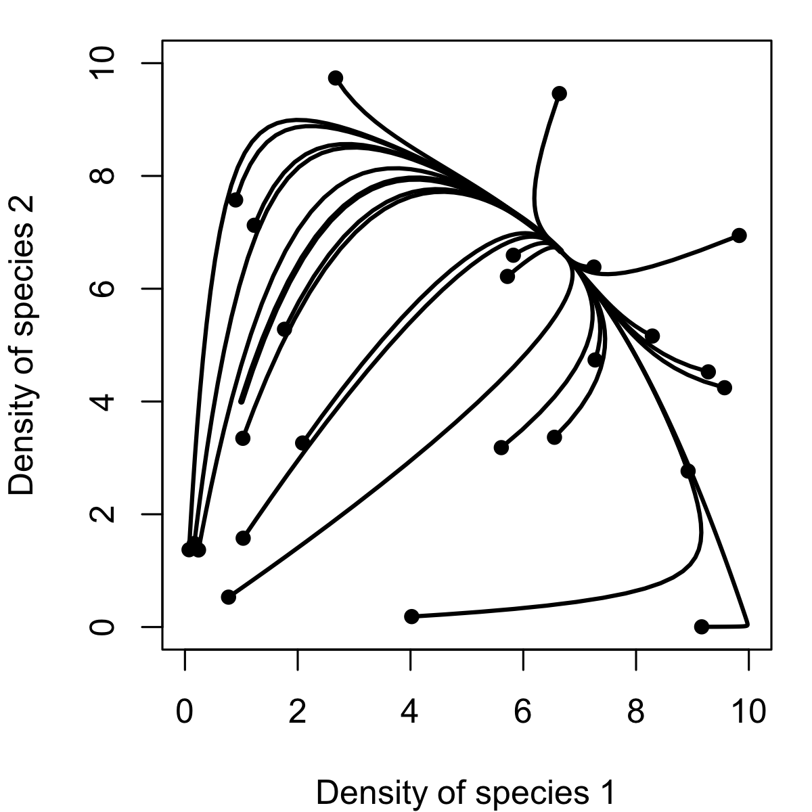
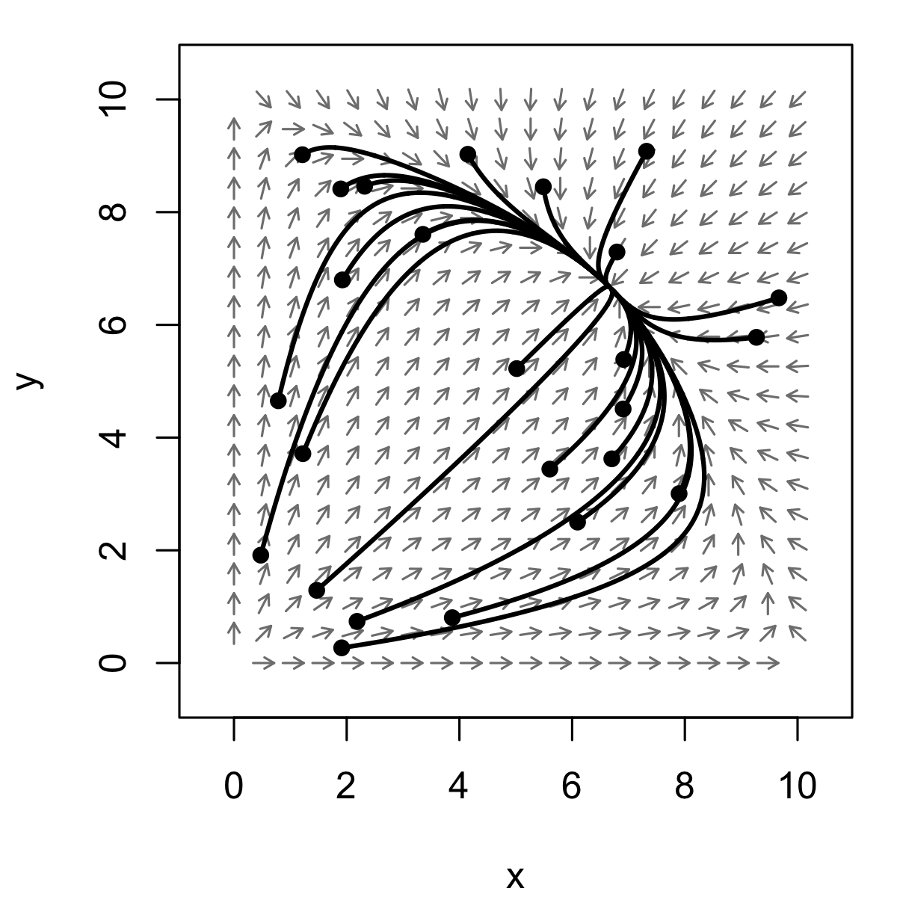
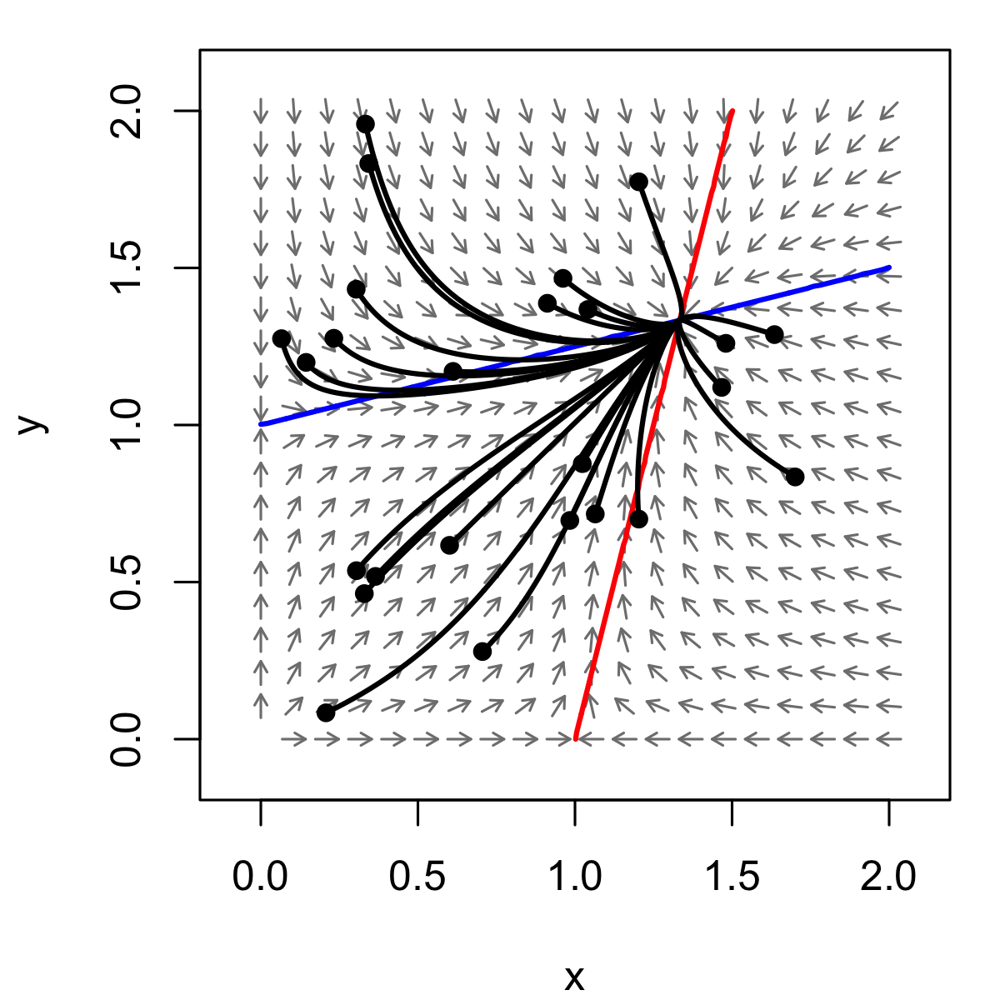
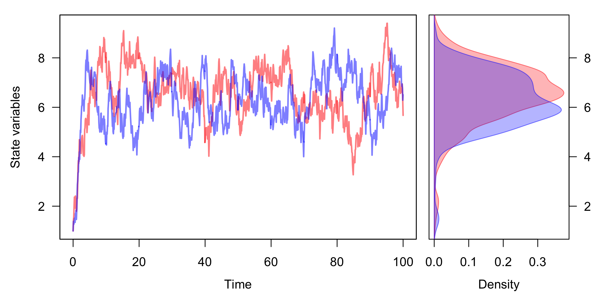
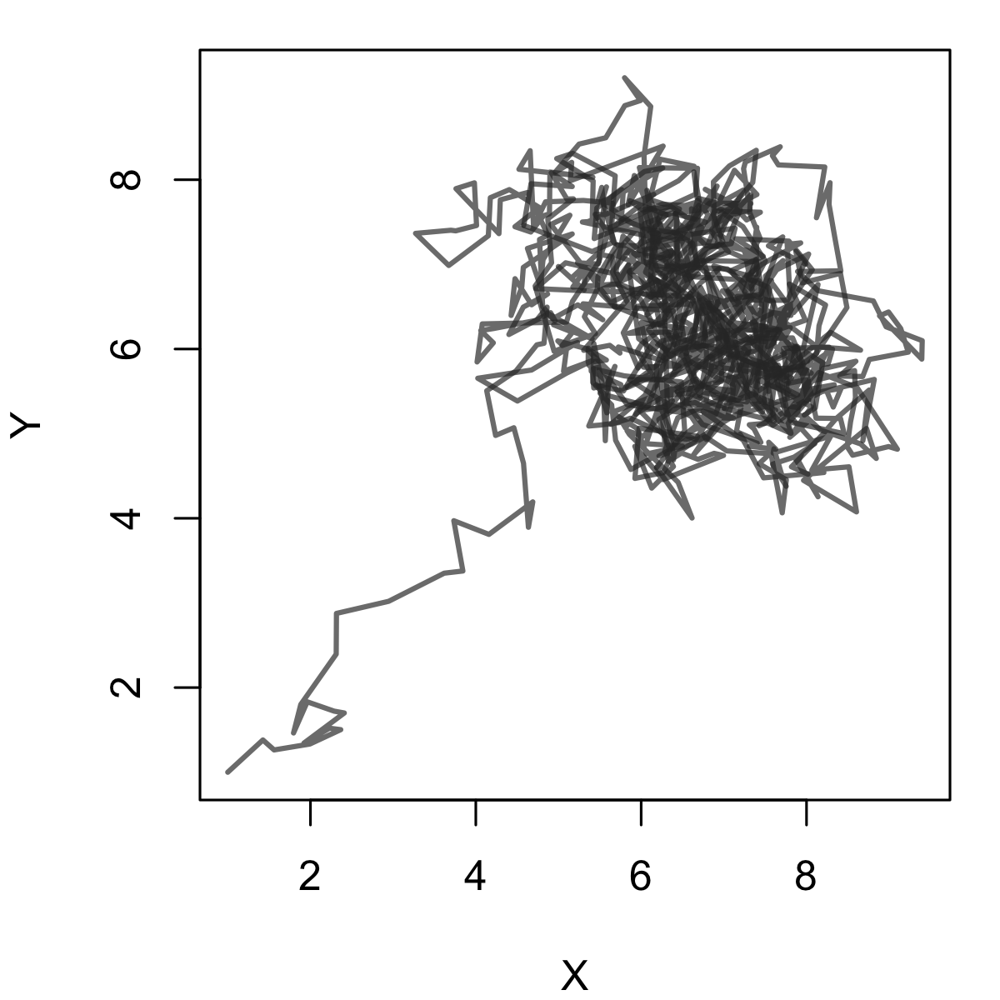
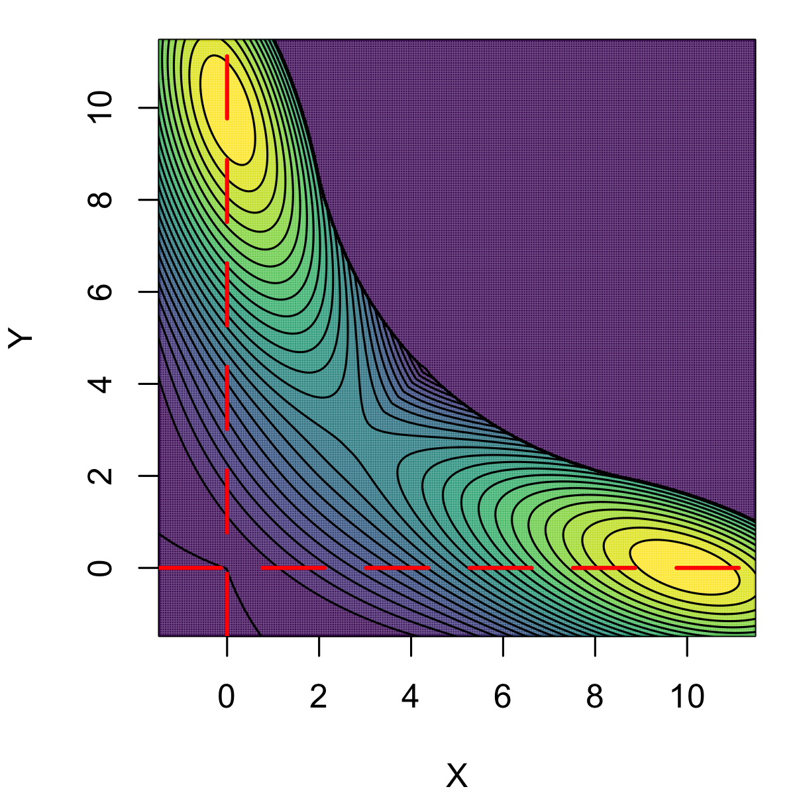

QPOT: Quasi-POTential analysis for stochastic differential equations
========================================================
author: Christopher M. Moore
date: 17 August 2016
autosize: true
width: 1440
height: 900


Cleveland R Users Group

Some R notes, pt. I
========================================================
- Packages I'll be using if you want to follow along

```r
  library(package = "deSolve") # Solver for differential equations
  library(package = "rootSolve") # Finds roots, Jacobian matrices, and estimates steady-state conditions
  library(package = "phaseR") # Tools for graphing 
  library(package = "MASS") # For 2-D density estimator
  library(package = "QPot") # Our package!
  library(package = "viridis") # Great color map
```
- For this presentation, I opened RStudio for the second time, and updated from v. ~2012

Some R notes, pt. II
========================================================
### Based primarily on two works
  1. Nolting and Abbott's *Ecology* paper
    - B. C. Nolting and K. C. Abbott. Balls, cups, and quasi-potentials: Quantifying stability in stochastic systems. Ecology, 97(4):850–864, 2016.
  2. Our R package and paper
    - C.M. Moore, C.R. Stieha, B.C. Nolting, M.K. Cameron, and K.C. Abbott. QPot: Quasi-Potential Analysis for Stochastic Differential Equations, 2016. URL [https://www.R-project.org/package=QPot](https://www.R-project.org/package=QPot). R package version 1.2.
    - Moore, C.M., Stieha, C.R., Nolting, B.C., Cameron, M.K. and Abbott, K.C. 2015. QPot: An R Package for Stochastic Differential Equation Quasi-Potential Analysis. [arXiv preprint arXiv:1510.07992](http://arxiv.org/abs/1510.07992).

Ecology: a science of dynamics and complexity
========================================================
**The study of the spatial and temporal patterns of the distributions and abundances of organisms, including causes and consequences**

Ecology is hierarchically organized:
  - Individuals
  - Populations
  - Communities
  - Ecosystems

Today's focus, *population ecology*, is strongly quantitative and mathematical

Differential equations: as models
========================================================
$$\frac{\text{change in a variable}}{\text{change in another variable}}$$

if $~x$ is a variable that is dependent on variable $~y$, then we can write

$$\frac{d x}{d y}$$

with time, $~t$, as the independent variable

$$\frac{d x}{d t}$$

Differential equations: some examples, pt. I
========================================================
Growth of $~x$ at a rate, $~\alpha$
$$\frac{dx}{dt} = \alpha x $$

Logistic equation, with growth of $~x$ at a rate $~\alpha$, and negative density-dependent growth (crowding effect) of strength $\gamma$ and interaction between $x \times x$:

$$\frac{dx}{dt} = \alpha x - \gamma x^2$$


Differential equations: some examples, pt. II
========================================================
Competition between species $~N_1$ and $~N_2$

$$\frac{dN_1}{dt} = r_1N_1 - \alpha_{11} N_1N_1  - \beta_{21} N_2N_1 \\
\frac{dN_2}{dt} = r_2N_2 - \alpha_{22} N_2N_2  - \beta_{12} N_1N_2$$

Disease model of susceptible, $~S$, infected $~I$, and recovered, $~R$

$$\frac{dS}{dt} = \alpha S - \beta SI + \delta R - d_SS \\
\frac{dI}{dt} = \beta SI -\gamma I - d_II \\
\frac{dR}{dt} = \gamma I -\delta R - d_RR$$


Differential equations in R: deSolve format, pt. I
========================================================
`deSolve` has set the standard, with:

- Function arguments
  - time
  - initial conditions as a named vector, `y0`, for each of the variables
  - parameters as a named vector
- Returns a list of variable values

Differential equations in R: deSolve format, pt. II
========================================================
*The mathematics of uncontrolled growth are frigtening.*  **A single cell** *of the bacterium E. coli would, under ideal circumstances,* **divide every twenty minutes**.  *That is not particularly disturbing until you think about it, but the fact is that bacteria multiply geometrically: one becomes two, two become four, four become eight, and so on.  In this way,* **it can be shown that in a single day, one cell of E. coli could producece a super-colony equal in size and weight to the entire planet earth.**---M. Chrichton (1969), *The Andromeda Strain* (Dell, New York, p. 247)

$$\frac{dx}{dt} = \alpha x = 2x$$

Differential equations in R: deSolve format, pt. III
========================================================
$$\frac{dx}{dt} = \alpha x = 2x$$

```r
growth <- function(t, y0, parameters){
  with(as.list(c(y0, parameters)), {
    dx = alpha*x
    list(c(dx))
  })
}
```


```r
growth(y0 = c(x = 1), parameters = c(alpha = 2))
```

```
[[1]]
[1] 2
```

Differential equations in R: deSolve::ode
========================================================
$$\frac{dx}{dt} = \alpha x = 2x$$


```r
start <- c(x = 1)
parameters <- c(alpha = 2)
hours <- seq(from = 0, to = 24, by = (1/3))

out <- ode(y = start, times = hours, func = growth, parms = parameters)
out[1:3,]
```

```
          time        x
[1,] 0.0000000 1.000000
[2,] 0.3333333 1.947737
[3,] 0.6666667 3.793677
```

Differential equations in R: plot deSolve::ode
========================================================
$$\frac{dx}{dt} = \alpha x = 2x$$


```
        time            x 
2.400000e+01 7.017045e+20 
```

```r
plot(out[,1], out[,2], xlab = "Time", ylab = "x", type = "l", lwd = 2)
```


Differential equations in R: 2-D competition
========================================================
Competition between species $~N_1$ and $~N_2$

$$\frac{dN_1}{dt} = r_1N_1 - \alpha_{11} N_1N_1  - \beta_{21} N_2N_1 \\
\frac{dN_2}{dt} = r_2N_2 - \alpha_{22} N_2N_2  - \beta_{12} N_1N_2$$

- $r_i$, the population growth rate of species $i$
- $\alpha_{ii}$, competition between the same species $i$
- $\beta_{ji}$, the competitive effect of species $j$ on species $i$

Differential equations in R: competition in ode
========================================================

```r
comp <- function(t, y0, parameters){
  with(as.list(c(y0, parameters)), {
  dx <- r1*x - a11*x*x - b21*y*x
  dy <- r2*y - a22*y*y - b12*x*y
  list(c(dx, dy))
  })
}
state <- c(x = 1, y = 4)
parameters <- c(r1 = 1, r2 = 1, a11 = 0.1, a22 = 0.1, b12 = 0.05, b21 = 0.05)
time <- seq(from = 0, to = 25, length.out = 100)
out <- ode(y = state, times = time, func = comp, parms = parameters)
```

Differential equations in R: competition over time
========================================================

```r
plot(out[,1], out[,2], type = "l", col = "red", xlab = "Time", ylab = "Density of\nspecies 1 (red) and species 2 (blue)", ylim = c(0, max(out[,c(2,3)], na.rm = T)), lwd = 2)
lines(out[,1], out[,3], col = "blue", lwd = 2)
```


Differential equations in R: competition in phase space
========================================================

```r
plot(out[,2], out[,3], xlab = "Density of species 1", ylab = "Density of species 2", type = "l", lwd = 2, xlim = c(0, 10), ylim = c(0, 10))
points(out[1, 2], out[1, 3], pch = 16)
```


Differential equations in R: competition trajectories
========================================================

```r
plot(out[,2], out[,3], xlab = "Density of species 1", ylab = "Density of species 2", type = "l", lwd = 3, xlim = c(0, 10), ylim = c(0, 10))
for (i in 1:25){
  state <- c(x = runif(n = 1, min = 0, max = 10), y = runif(n = 1, min = 0, max = 10))
  out <- ode(y = state, times = time, func = comp, parms = parameters)
  lines(out[,2], out[,3], lwd = 2)
  points(out[1, 2], out[1, 3], pch = 16)
}
```


Differential equations in R: phaseR::flowField format
========================================================

```r
comp <- function(t, y0, parameters){
  with(as.list(c(y0, parameters)), {
  x <- y0[1]
  y <- y0[2]
  dx <- r1*x - a11*x*x - b21*y*x
  dy <- r2*y - a22*y*y - b12*x*y
  list(c(dx, dy))
  })
}
```

Differential equations in R: phaseR::flowField plot
========================================================

```r
ff <- flowField(deriv = comp, x.lim = c(0, 10), y.lim = c(0, 10), parameters = parameters, points = 20, add = F, col = "black", arrow.type = "equal")
```




Differential equations in R: phaseR::flowField trajectories
========================================================

```r
ff <- flowField(deriv = comp, x.lim = c(0, 10), y.lim = c(0, 10), parameters = parameters, points = 20, add = F, col = "grey50")
for (i in 1:25){
  xy.start <- c(runif(n = 1, min = 0, max = 10), runif(n = 1, min = 0, max = 10))
  traj <- trajectory(deriv = comp, y0 = xy.start, parameters = parameters, col = "black", t.end = 10, pch = 16, lwd = 2)
}
```


Differential equations in R: competitive exclusion
========================================================

```r
parameters.ce <- c(r1 = 1, r2 = 1, a11 = 0.1, a22 = 0.1, b21 = 0.25, b12 = 0.25)
ff <- flowField(deriv = comp, x.lim = c(0, 10), y.lim = c(0, 10), parameters = parameters.ce, points = 20, add = F, col = "grey50")
abline(h = 0, v = 0)
for (i in 1:15){
  xy.start <- c(runif(n = 1, min = 0, max = 10), runif(n = 1, min = 0, max = 10))
  traj <- trajectory(deriv = comp, y0 = xy.start, parameters = parameters.ce, col = "black", t.end = 25, lwd = 2, pch = 16)
}
```


Differential equations in R: cyclic behaviors
========================================================

$$\frac{dR}{dt} = bR - cRC \\
\frac{dC}{dt} = dRC - eC$$

```r
ff <- flowField(deriv = prey.predator, x.lim = c(0, 3), y.lim = c(0, 3), parameters = parameters, points = 20, add = F, col = "black", xlab = "R", ylab = "C")
```




Differential equations in R: unstable behaviors, pt. I
========================================================

$$\frac{dN_1}{dt} = r_1N_1 - \alpha _{11}N_1^2 + \beta _{21}N_2N_1 \\
\frac{dN_2}{dt} = r_2N_2 - \alpha _{22}N_2^2 + \beta _{12}N_1N_2$$

```r
ff <- flowField(deriv = mut, x.lim = c(0, 2), y.lim = c(0, 2), parameters = parameters, points = 20, add = F, col = "black")
nc <- nullclines(deriv = mut, x.lim = c(0, 2), y.lim = c(0, 2), parameters = parameters, lwd = 2)
```


Differential equations in R: unstable behaviors, pt. II
========================================================

$$\frac{dN_1}{dt} = r_1N_1 - \alpha _{11}N_1^2 + \beta _{21}N_2N_1 \\
\frac{dN_2}{dt} = r_2N_2 - \alpha _{22}N_2^2 + \beta _{12}N_1N_2$$

```r
ff <- flowField(deriv = mut, x.lim = c(0, 2), y.lim = c(0, 2), parameters = parameters, points = 20, add = F, col = "black")
nc <- nullclines(deriv = mut, x.lim = c(0, 2), y.lim = c(0, 2), parameters = parameters, lwd = 2)
```




Stochasticity: its role in ecology and stability
========================================================
- Model unexplained variation in a variable
- Ecology, like other complex systems, is riddled with a multiplicity of processes ignored by simple, deterministic models
- Consequently, we can model unexplained variation
- [CRAN Task View: Differential Equations](https://cran.r-project.org/web/views/DifferentialEquations.html)

QPOT: stochastic differential equation and a realization
========================================================
$$dN_1 = \left(r_1N_1 - \alpha_{11} N_1N_1  - \beta_{21} N_2N_1\right)dt + \sigma_1 dW_1\\
dN_2 = \left(r_2N_2 - \alpha_{22} N_2N_2  - \beta_{12} N_1N_2\right)dt + \sigma_2 dW_2$$


```r
parameters <- c(r1 = 1, r2 = 1, a11 = 0.1, a22 = 0.1, b12 = 0.05, b21 = 0.05)
model.deltat <- 0.1
ms <- Model2String(model = comp, parms = parameters, deSolve.form = T, supress.print = T)
ts <- TSTraj(y0 = c(x = 1, y = 1), time = 100, deltat = model.deltat, x.rhs = ms[1], y.rhs = ms[2], sigma = 1, lower.bound = 0)
```

QPOT: stochastic simulations, time series
========================================================


```r
TSPlot(mat = ts, deltat = model.deltat)
```


QPOT: stochastic simulations, realization and density
========================================================

```r
TSPlot(ts, deltat = model.deltat, dim = 2)
TSDensity(mat = ts, deltat = model.deltat, dim = 2, col2d = viridis(100, option = "A"))
```



QPOT: what is the quasi-potential
========================================================
The potential relates to the work needed to move from one point to another, with the areas of least potential at surface minima.


**The quasi-potential is a tool that yields information about properties of stochastic systems, such as the expected time to escape a basin of attraction, the expected frequency of transitions between basins, and the stationary probability distribution.**


QPOT: how is the quasi-potential calculated
========================================================
### Ordered Upwind Method
**Calucualtes the minimal cost path on a surface**

Sources for more information

1. Cameron, M.K. (2012). Finding the quasipotential for nongradient SDE’s. *Physica D* 241, 1532-1550.
2. Sethian, J.A. and Vladimirsky, A. (2003). Ordered upwind methods for static Hamilton–Jacobi equations: Theory and algorithms. *SIAM Journal on Numerical Analysis* 41(1), 325-363.
3. Sethian, J.A. and Vladimirsky, A. (2001). Ordered upwind methods for static Hamilton–Jacobi equations. *PNAS* 98(20), 11069-11074.


QPOT: competition example, revisited
========================================================
 

QPOT: competition example, with stochasticity
========================================================



QPOT: competition example, finding stable equilibrium points
========================================================
## Analytically
 $$\frac{dN_1}{dt} = r_1N_1 - \alpha_{11} N_1N_1  - \beta_{21} N_2N_1 \\
 0 = r_1N_1 - \alpha_{11} N_1N_1  - \beta_{21} N_2N_1 \\
 0 = N_1\left(r_1 - \alpha_{11} N_1  - \beta_{21} N_2\right) \\
 0 = r_1 - \alpha_{11} N_1  - \beta_{21} N_2 \\
 \alpha_{11} N_1 = r_1 - \beta_{21} N_2 \\
 N_1^* = \frac{r_1 - \beta_{21} N_2}{\alpha_{11}}$$

## Numerically
- deSolve::ode
- rootSolve::steady

QPOT: competition example, local quasi-potential
========================================================

```r
ce <- Model2String(model = comp, parms = parameters.ce, deSolve.form = T)
local.1 <- QPotential(x.rhs = ce[1], x.start = 0, x.bound = c(-5, 15), x.num.steps = 2000, y.rhs = ce[2], y.start = 10, y.bound = c(-5, 15), y.num.steps = 2000)
QPContour(surface = local.1, dens = c(500, 500), x.bound = c(-1, 15), y.bound = c(-1, 15))
```


QPOT: competition example, global quasi-potentials
========================================================

```r
saddle <- steady(y = c(3,3), func = comp, parms = parameters.ce)
saddle$y
```

```
[1] 2.857143 2.857143
```


```r
global.qp <- QPGlobal(local.surfaces = list(local.1, local.2), unstable.eq.x = c(saddle$y[1]), unstable.eq.y = c(saddle$y[2]), x.bound = c(-5, 15), y.bound = c(-5, 15))
QPContour(surface = global.qp, dens = c(1000, 1000), x.bound = c(-5, 15), y.bound = c(-5, 15), xlim = c(-1, 11), ylim = c(-1, 11))
```


QPOT: a disagreement in stability
========================================================
 $$\frac{dx(t)}{dt} = \alpha x(t)\left(1 - \frac{x(t)}{\beta}\right) - \frac{\delta x^2(t)y(t)}{\kappa + x^2(t)}$$
$$\frac{dy(t)}{dt} = \frac{\gamma x^2(t)y(t)}{\kappa + x^2(t)} - \mu y^2(t)$$




Closing remarks
========================================================


Thank you
========================================================
- Website: [mutualismecology.com](mutualismecology.com)
- Email: [life.dispersing@gmail.com](life.dispersing@gmail.com)
- Twitter: [@lifedispersing](https://twitter.com/lifedispersing)
